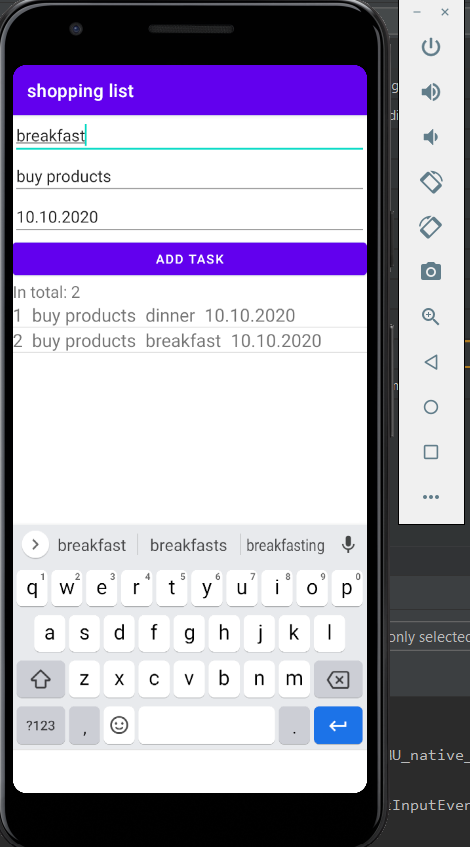
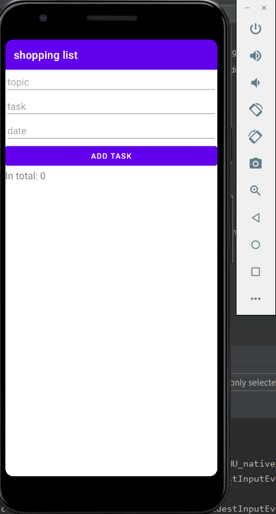

# todo-list-android
## Приложение "Заметки" / "Список покупок"

[**video**](video.mp4)

 

Используя работу с базой данных SQLite, реализовать простейший вариант приложения "Заметки" или "Список покупок". Должны присутствовать следующие функции:

1) Отображение текста и даты заметки (списка товаров и их стоимости). Рекомендуется использовать виджет ListView и SimpleCursorAdapter для связи ListView и данных в таблице.

2) Добавление записей: текст заметки (название товара и его стоимость) вводятся в текстовые поля и при нажатии кнопки добавляются в таблицу БД.

3) Подсчёт и отображение общего числа заметок (товаров и их общей стоимости).

Примеры проектов для ознакомления: https://github.com/ipetrushin/SimpleSQLiteExample

https://github.com/ipetrushin/DBTest​ https://github.com/ipetrushin/AdapterExample

http://developer.alexanderklimov.ru/android/sqlite/android-sqlite.php

Работа с SimpleCursorAdapter https://metanit.com/java/android/14.1.php

Пример разработки приложения СУБД http://youtube.com/watch?v=C94uSZoLZys
